## [REST API](http://localhost:8080/doc)

## Концепция:

<details>
<summary style="color: skyblue">Показать детали</summary>

- Spring Modulith
    - [Spring Modulith: достигли ли мы зрелости модульности](https://habr.com/ru/post/701984/)
    - [Introducing Spring Modulith](https://spring.io/blog/2022/10/21/introducing-spring-modulith)
    - [Spring Modulith - Reference documentation](https://docs.spring.io/spring-modulith/docs/current-SNAPSHOT/reference/html/)

```
  url: jdbc:postgresql://localhost:5432/jira
  username: jira
  password: JiraRush
```

- Есть 2 общие таблицы, на которых не fk
    - _Reference_ - справочник. Связь делаем по _code_ (по id нельзя, тк id привязано к окружению-конкретной базе)
    - _UserBelong_ - привязка юзеров с типом (owner, lead, ...) к объекту (таска, проект, спринт, ...). FK вручную будем
      проверять

</details>

## Аналоги

- https://java-source.net/open-source/issue-trackers

## Тестирование

- https://habr.com/ru/articles/259055/

## Список выполненных задач: (задачи в процессе выполнения)

> При регистрации аккаунта, должно отправляться письмо с подтверждением емайл, но предоставленный `test-mail: jira4jr@gmail.com` и пароль видимо уже недоступны к использованию. Можно подключить свой ящик, если это `google`, то генерация пароля доступна по [ссылке](https://myaccount.google.com/apppasswords) и создать `secret.env` c переменными как в `secret.env.example`. Для запуска из под IDEA используем `Environment variables`

1. ✅**Разобраться со структурой проекта (onboarding)**
2. ✅**Удалить социальные сети: vk, yandex**
   * Удалены кнопки из шаблонов 
      - `resources/view/unauth/register.html`  
      - `resources/view/login.html`
   * Удалены классы  
      - `com.javarush.jira.login.internal.sociallogin.handler.YandexOAuth2UserDataHandler`   
      - `com.javarush.jira.login.internal.sociallogin.handler.VkOAuth2UserDataHandler`
   * Почищен `application.yaml`
3. ✅**Вынести чувствительную информацию в отдельный проперти файл**  
    
    - Создан файл `application-secrets.yaml`  в котором используются переменные окружения в виде `${VARIABLE_NAME:default_value}`
    - Для `docker-compose` добавлен `secret.env`
    - путь к файлу `src/main/resources/application-secrets.yaml`  <details><summary style="color: skyblue;">Показать скрин файла</summary>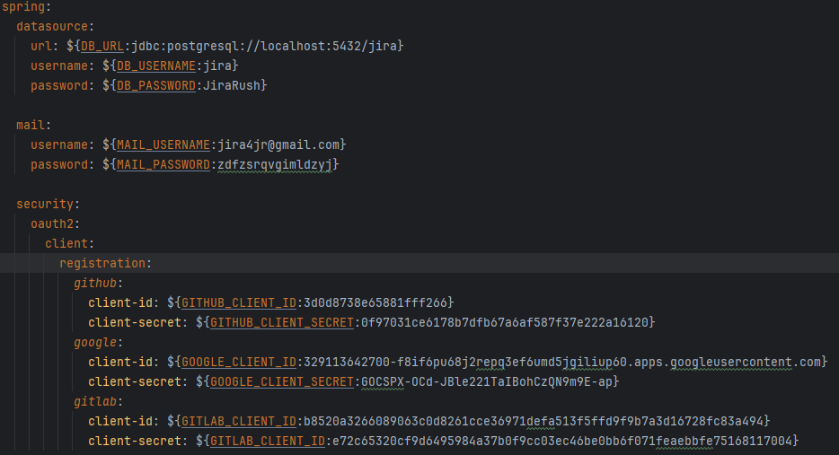</details>

4. ✅**Переделать тесты так, чтоб во время тестов использовалась in memory БД (H2), а не PostgreSQL.**  
    - Создан файл с измененным тестовым скриптом под БД H2 [src/test/resources/changelog_H2.sql](https://github.com/Woody-rn/project-final/blob/nikitin/src/test/resources/changelog_H2.sql) 
    - Изменил [src/test/resources/application-test.yaml](https://github.com/Woody-rn/project-final/blob/master/src/test/resources/application-test.yaml) и не пришлось определять дополнительные бины  
    - В `AbstractControllerTest` поправил файл скрипта  
    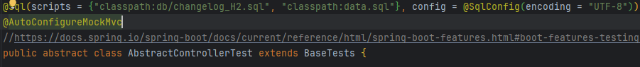
5. ✅**Написать тесты для всех публичных методов контроллера ProfileRestController**  
   - Тесты написаны [открыть ProfileRestControllerTest](https://github.com/Woody-rn/project-final/blob/nikitin/src/test/java/com/javarush/jira/profile/internal/web/ProfileRestControllerTest.java)  
    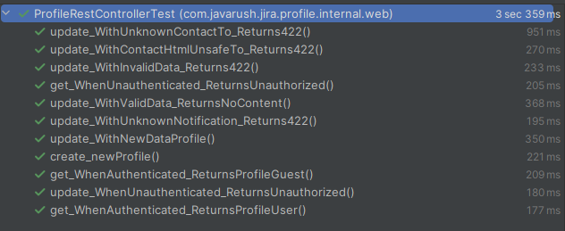
6. ✅**Сделать рефакторинг метода com.javarush.jira.bugtracking.attachment.FileUtil#upload чтоб он использовал современный
   подход для работы с файловой системмой**  
    - Код переписан [открыть FileUtil#upload](https://github.com/Woody-rn/project-final/blob/nikitin/src/main/java/com/javarush/jira/bugtracking/attachment/FileUtil.java)
    - `Files.createDirectories(dirPath)` автоматически создаёт все недостающие директории в пути
    - `Files.write()` создает(если не существует) и перезаписывает файл, так же автоматически закрывает ресурсы
    - 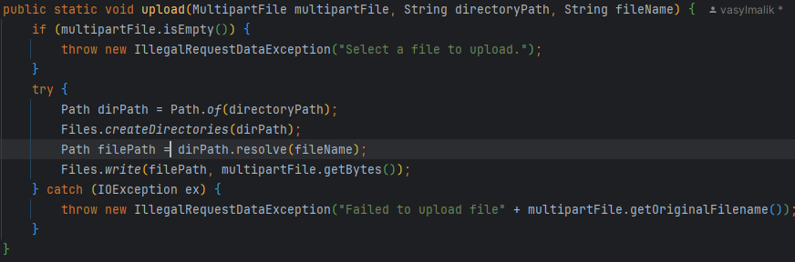
7. ✅**Добавить новый функционал: добавления тегов к задаче (REST API + реализация на сервисе)**  
    - В [`TaskController`](https://github.com/Woody-rn/project-final/blob/nikitin/src/main/java/com/javarush/jira/bugtracking/task/TaskController.java) добавлены методы `addTags`, `getTags`, `removeTag` и добавлена информация для Swagger. Также контроллер помечен `@Validated` для работы валидации  <details><summary style="color: skyblue;">Показать скрин контроллера</summary>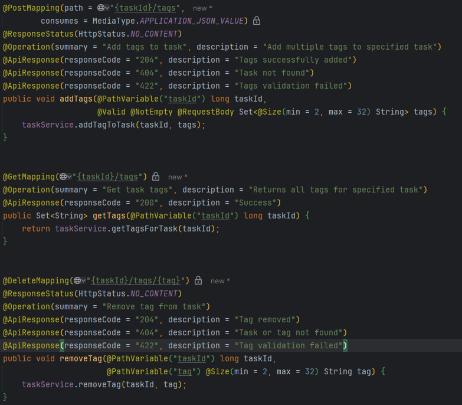</details>
    - В [`TaskService`](https://github.com/Woody-rn/project-final/blob/nikitin/src/main/java/com/javarush/jira/bugtracking/task/TaskService.java) добавлены методы `addTagToTask`, `getTagsForTask`, `removeTag`.  <details><summary style="color: skyblue;">Показать скрин сервиса</summary>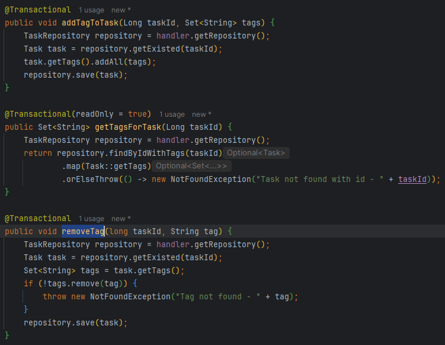</details>
    - Так как в `Task` поле `tag` помечено как `@ElementCollection(fetch = FetchType.LAZY)` в репозитории `TaskRepository` добавлен метод для возврата задачи с загруженными тегами   
    `@Query("SELECT t FROM Task t LEFT JOIN FETCH t.tags WHERE t.id = :taskId")`  
    `Optional<Task> findByIdWithTags(Long taskId);`
8. ✅**Добавить подсчет времени сколько задача находилась в работе и тестировании**
    - Создан `changelog-add-data-activity.sql` добавляющий три записи в таблицу ACTIVITY для задачи с id=99
    - С заделом на будущее создан Enum [`StatusCode`](https://github.com/Woody-rn/project-final/blob/nikitin/src/main/java/com/javarush/jira/bugtracking/task/StatusCode.java)
    - В репозитории добавлен метод возвращающий список всех записей активности для указанной задачи   
      `@Query("SELECT a FROM Activity a where a.taskId =:taskId")`   
      `List<Activity> findAllByTaskId(long taskId);`
    - Добавлены endpoints в [`TaskController`](https://github.com/Woody-rn/project-final/blob/nikitin/src/main/java/com/javarush/jira/bugtracking/task/TaskController.java) 
      `{taskId}/work-time` и `{taskId}/testing-time` возвращающие результат вычисления задачи в секундах  <details> <summary style="color: skyblue"> Показать детали</summary>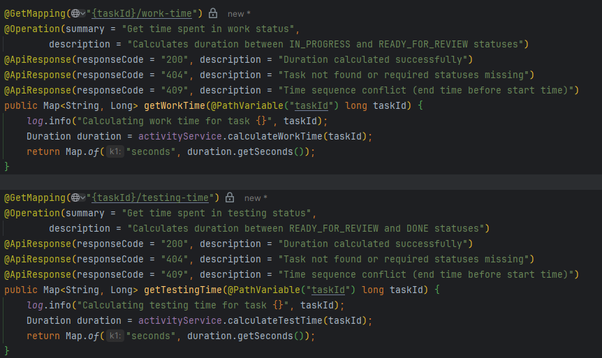 </details> 
    - Добавлены методы в [`ActivityService`](https://github.com/Woody-rn/project-final/blob/nikitin/src/main/java/com/javarush/jira/bugtracking/task/ActivityService.java) для подсчета времени сколько задача находилась в работе и тестировании<details> <summary style="color: skyblue"> Показать детали</summary>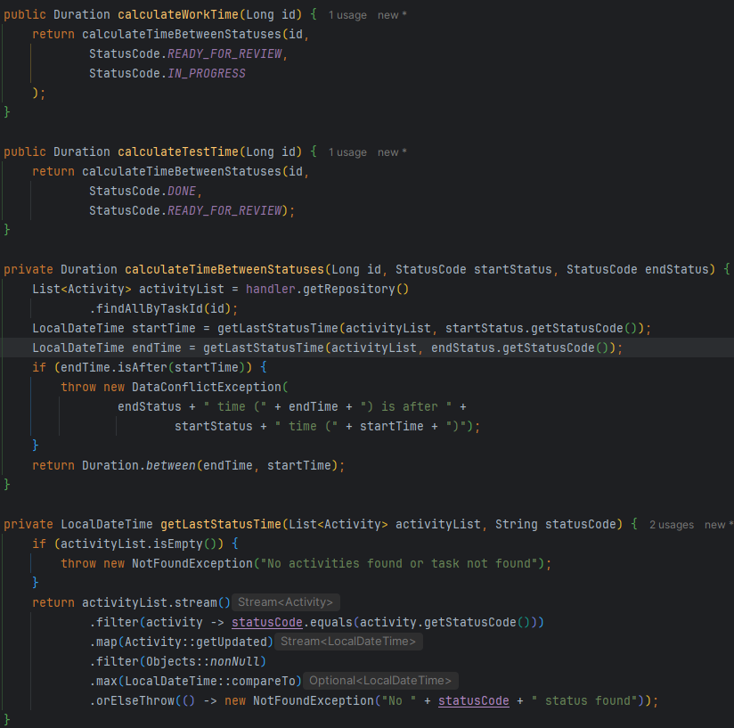 </details> 
9. ✅**Написать Dockerfile для основного сервера**  

    - 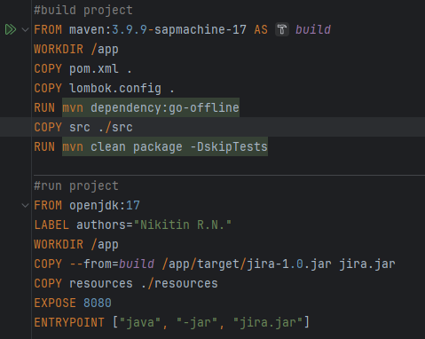

10. ✅**Написать docker-compose файл для запуска контейнера сервера вместе с БД и nginx**  
    - Открыть [docker-compose](https://github.com/Woody-rn/project-final/blob/nikitin/docker-compose.yaml)
    - В `nginx.conf` заменены адреса с `localhost` на имя сервиса/контейнера приложения указанного в docker-compose `proxy_pass http://jira-app:8080;`
    - Добавлен liquibase `changelog-master.xml` соединяющий создание структуры и добавление данных. [Путь к файлу](https://github.com/Woody-rn/project-final/tree/nikitin/src/main/resources/db)
11. ✅**Добавить локализацию минимум на двух языках для шаблонов писем (mails) и стартовой страницы index.html**
    - Добавлены русский и английский языки для шаблонов `index.html`, `header.html`, `email-confirmation.html`, `password-reset.html`
        
    - Емайл `jira4jr@gmail.com` из проекта не работает, подключил свою почту для отправки писем при регистрации 
    - В [`MailService`](https://github.com/Woody-rn/project-final/blob/nikitin/src/main/java/com/javarush/jira/mail/MailService.java) в методе `getContent` была прибита гвоздями русская локаль, использовал`Locale locale = LocaleContextHolder.getLocale();` для корректной работы интернационализации
    - Добавлен свичер языка в хедер
    - Добавлен конфигурационный класс [`LocaleConfig.java`](https://github.com/Woody-rn/project-final/blob/nikitin/src/main/java/com/javarush/jira/common/internal/config/LocaleConfig.java) <details><summary style="color: skyblue">Показать детали</summary>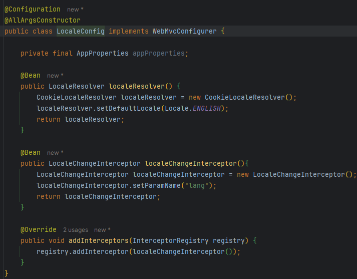    
    
    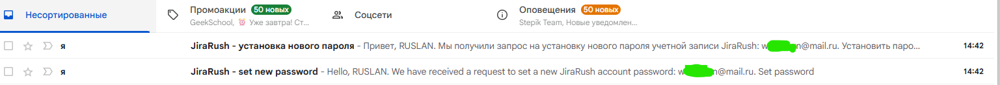</details>
12. ❌**Переделать механизм распознавания «свой-чужой» между фронтом и беком с JSESSIONID на JWT**
    Ещё не приступал, только изучил тематику

